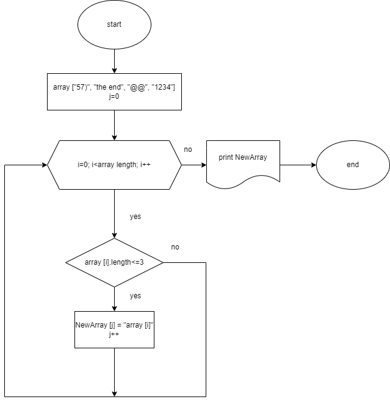

1. Дан массив **array ["57)","the end","@@","1234"]** 
2. При помощи цикла FOR проверяем длину каждого значение массива. Где индекс (**i**) равен 0, чтобы начать с первого значения в массиве. После каждой итерации увеличиваем его на 1, чтобы пройти все значения в массиве. Из цикла выходим тогда, когда индекс последнего значения станет равен длине массива, т.е. мы попытаемся "выйти" за длину массива.  
3. Если длина значения данного массива меньше или равна 3, то записываем это значение в новый массив **NewArray**. Чтобы не запутаться, индексу нового массива присвоим имя **j**. При первой итерации j равен 0, что мы указали в самом начале блок-схемы. После каждой записи в новый массив, j увеличиваем на 1, чтобы переходить от первого индекса к следующему.  
4. Если длина значения данного массива больше 3, то, проверяем следующее значение. 
5. Когда цикл завершится, выводим новый массив.